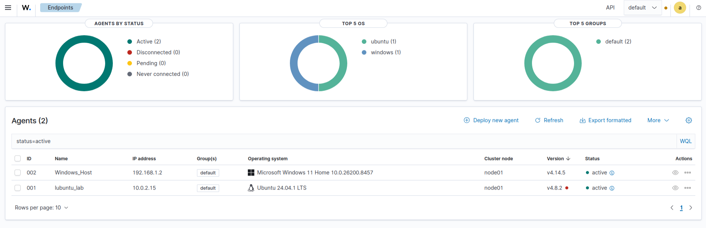
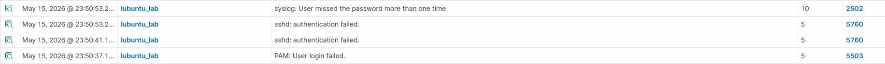
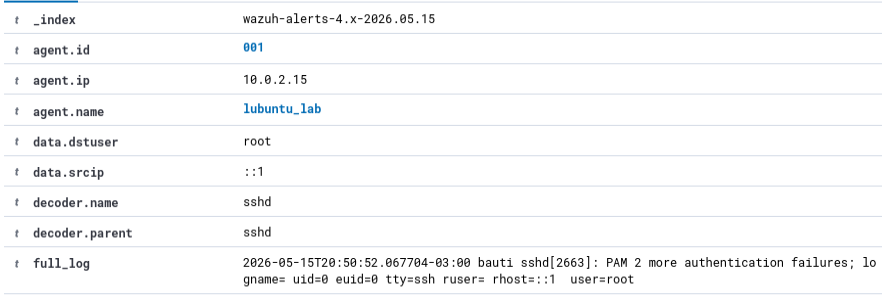
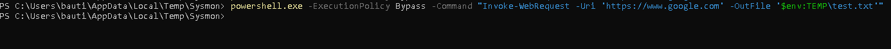
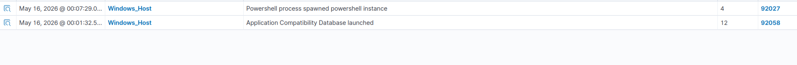
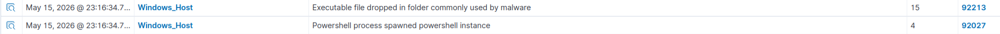
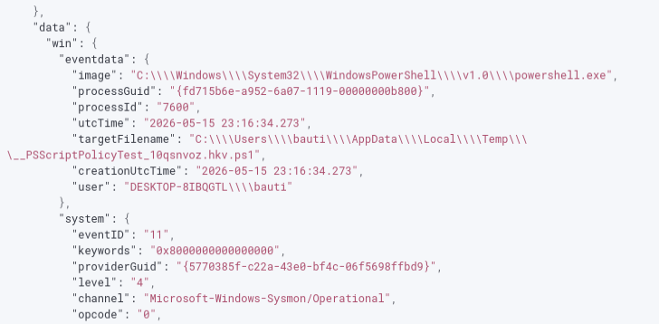
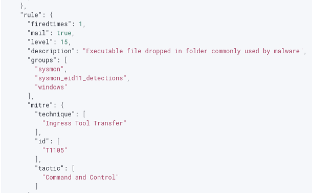

# 🎯 Laboratorio: WAZUH SIEM & EDR (Monitoreo Multi-OS)

**📅 Fecha:** 15 y 16 de mayo de 2026 
**🖥️ Entorno:** Servidor Wazuh (Manager) / Agentes: Windows 11 Home y Lubuntu 24.04.1 LTS

---

## 🛠️ Contexto y Despliegue Inicial
El objetivo de este laboratorio fue implementar una solución centralizada de SIEM y XDR para monitorear eventos de seguridad en un entorno heterogéneo. 
1. Se desplegó el servidor Manager de Wazuh.
2. Se instalaron y configuraron exitosamente los agentes de recolección en dos endpoints: una máquina `Windows_Host` (192.168.1.2) y una máquina `lubuntu_lab` (10.0.2.15).

## 🐧 Caso de Estudio 1: Monitoreo en Linux (Lubuntu)
Se simuló un escenario de ataque de fuerza bruta por SSH contra el endpoint Linux para evaluar las capacidades de detección de Wazuh sobre los logs de autenticación (PAM/sshd).

**Pasos realizados:**
1. Se generaron múltiples intentos de inicio de sesión fallidos de manera deliberada contra el servicio SSH del agente `lubuntu_lab`.
2. El agente recolectó los registros de `/var/log/auth.log` y los envió al Manager.
3. El motor de reglas de Wazuh correlacionó los eventos, disparando múltiples alertas, incluyendo la regla **5760** (sshd: authentication failed) y la regla compuesta **2502** (User missed the password more than one time).
4. Se analizó el log crudo (`full_log`), identificando el usuario objetivo (`root`), la IP de origen y el decodificador utilizado (`sshd`).

## 🪟 Caso de Estudio 2: Monitoreo en Windows con Sysmon
Se simuló la descarga de un archivo potencialmente malicioso en el endpoint Windows, integrando Wazuh con Microsoft Sysmon para obtener telemetría avanzada de creación de procesos y archivos.

**Pasos realizados:**
1. Desde la terminal de la máquina atacante/simulada, se ejecutó un comando de PowerShell saltando las políticas de ejecución (`-ExecutionPolicy Bypass`) para descargar un archivo desde internet usando `Invoke-WebRequest` y guardarlo en el directorio temporal (`$env:TEMP\test.txt`).
2. Wazuh detectó la instanciación inusual del motor de PowerShell (Regla **92027**: Powershell process spawned).
3. Gracias a la integración con Sysmon (Event ID 11: FileCreate), se detectó la creación del archivo en un directorio comúnmente abusado por malware (AppData\Local\Temp).
4. El sistema disparó una alerta de nivel **15** (Crítica) bajo la descripción: *Executable file dropped in folder commonly used by malware*.
5. Se analizó el JSON de la regla, verificando el correcto mapeo con el framework MITRE ATT&CK: **Táctica:** Command and Control / **Técnica:** Ingress Tool Transfer (T1105).

## 📸 Evidencias

*(Despliegue)*

*(Detección en Linux - SSH Brute Force)*

*(Simulación y Detección en Windows - Sysmon)*

---

## ⚠️ Riesgos asociados detectados
* **Ataques de Fuerza Bruta (Linux):** La falta de políticas de bloqueo (como Fail2Ban) o configuraciones restrictivas en SSH puede derivar en el compromiso de credenciales administrativas.
* **Ejecución de Código y Tool Transfer (Windows):** El uso de utilidades nativas del sistema (Living off the Land - LotL) como PowerShell para descargar payloads en directorios temporales es el paso inicial para el despliegue de Ransomware, C2 beacons o troyanos.

## 🛡️ Controles de seguridad recomendados
* **Para el entorno Linux:** Configurar autenticación exclusiva por claves públicas (PKI) en SSH, deshabilitar el acceso directo a `root` e implementar herramientas de bloqueo dinámico de IPs tras reiterados fallos de autenticación.
* **Para el entorno Windows:** Restringir el uso de PowerShell únicamente a administradores autorizados mediante AppLocker o Windows Defender Application Control (WDAC). Implementar políticas de Constrained Language Mode (CLM) para mitigar la ejecución de scripts no firmados.

## 🧠 Aprendizaje personal
Este laboratorio fue fundamental para comprender la arquitectura de recolección y correlación de un SIEM/EDR moderno. Aprendí a instalar y conectar agentes en arquitecturas dispares y validé la importancia de enriquecer los eventos nativos de Windows mediante **Sysmon**. Además, analizar el JSON de las alertas me permitió entender cómo plataformas como Wazuh mapean automáticamente los eventos crudos (Event ID 11) a tácticas y técnicas estructuradas del framework **MITRE ATT&CK** (T1105), facilitando el triage y la priorización de incidentes.