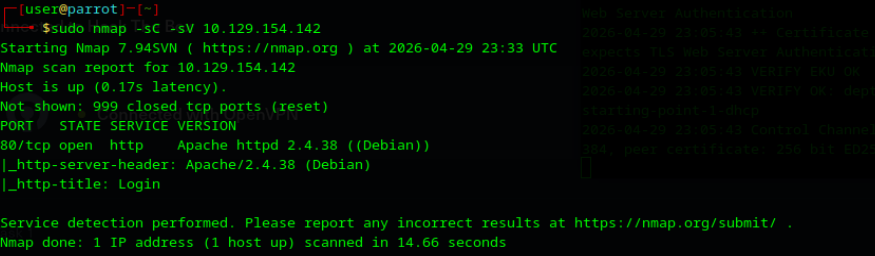
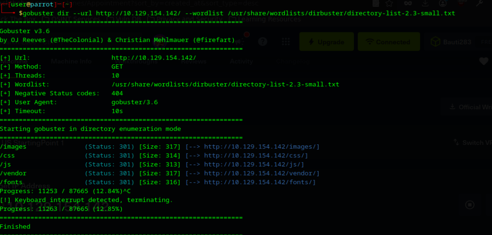
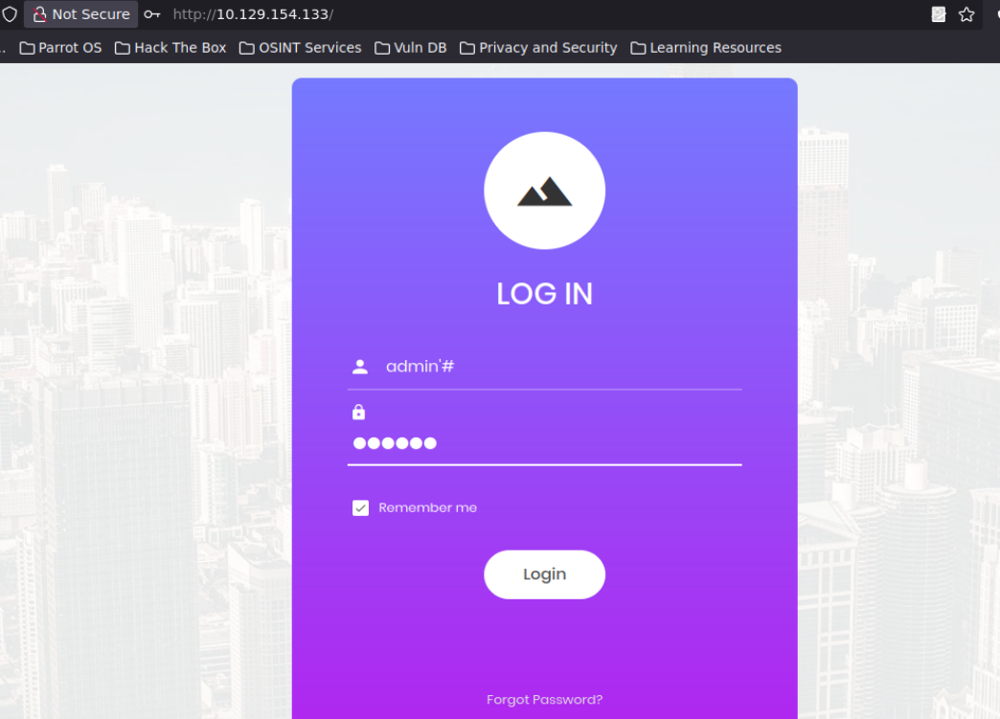
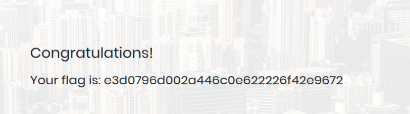

# 🎯 Laboratorio: APPOINTMENT

**📅 Fecha:** 29 de abril de 2026
**🖥️ IP objetivo:** 10.129.154.142

---

## 🛠️ Pasos realizados
1. 📡 Verifiqué el estado del host mediante el envío de trazas ICMP (ping).
2. 🔍 Ejecuté un escaneo de puertos y detección de servicios utilizando Nmap (`-sC -sV`), el cual reportó el puerto 80 (HTTP) activo ejecutando Apache httpd 2.4.38.
3. 📂 Realicé una fase de enumeración de directorios con Gobuster (`gobuster dir --url http://10.129.154.142/`).
4. 🛑 Tras identificar únicamente carpetas estructurales estándar (`/images`, `/css`, `/js`, `/vendor`) y sufrir una interrupción de enrutamiento, descarté este vector operativo al no hallar archivos o rutas de interés.
5. 🌐 Accedí a la aplicación web a través del navegador, identificando un portal de inicio de sesión.
6. 💉 Ejecuté una prueba de inyección SQL (SQLi) orientada a la evasión de autenticación (Authentication Bypass).
7. ⌨️ Inyecté el payload `admin'#` en el campo "Username", seguido de una cadena aleatoria en el campo "Password".
8. 🔓 El carácter `'` forzó el cierre de la cadena del usuario en la consulta del backend, mientras que el carácter `#` comentó (anuló) el resto de la instrucción SQL, omitiendo la validación obligatoria de la contraseña.
9. 🚩 La ejecución fue exitosa, otorgando acceso inmediato al panel restringido y revelando el mensaje de validación junto con la flag.

## 📸 Evidencias

---

## ⚠️ Vulnerabilidad identificada
Inyección SQL (SQLi) en el panel de autenticación de la aplicación web. El backend procesa las entradas del usuario concatenándolas directamente en la consulta SQL sin sanitizar caracteres especiales.

## 🚨 Riesgo asociado
Compromiso total del mecanismo de control de acceso. Esta vulnerabilidad crítica (clasificada en el OWASP Top 10 como A03:2021-Injection) permite a un atacante externo autenticarse con privilegios administrativos, lo que deriva en el acceso no autorizado a los datos del sistema, exfiltración de registros y manipulación completa de la base de datos de la organización.

## 🛡️ Controles recomendados
* **Consultas parametrizadas:** Reemplazar la concatenación directa de variables por el uso estricto de Prepared Statements en todo el código backend.
* **Validación de entradas:** Implementar mecanismos de Input Validation para filtrar y rechazar caracteres especiales no contemplados en la estructura de un nombre de usuario normal.
* **Defensa perimetral:** Considerar la implementación de un Web Application Firewall (WAF) para detectar y bloquear proactivamente patrones de ataques de inyección.

## 🧠 Aprendizaje
Comprobé que agotar las vías de reconocimiento tradicionales (como la enumeración de directorios) es parte del proceso, pero la superficie de ataque más crítica suele estar en cómo la aplicación procesa los datos del usuario. Entendí operativamente cómo un simple carácter de comentario (`#`) en MySQL puede comprometer todo el perímetro de seguridad si no hay sanitización en el código.