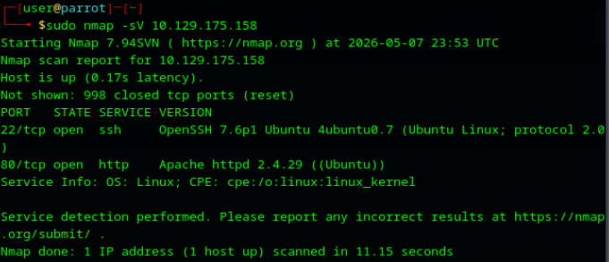
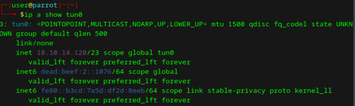
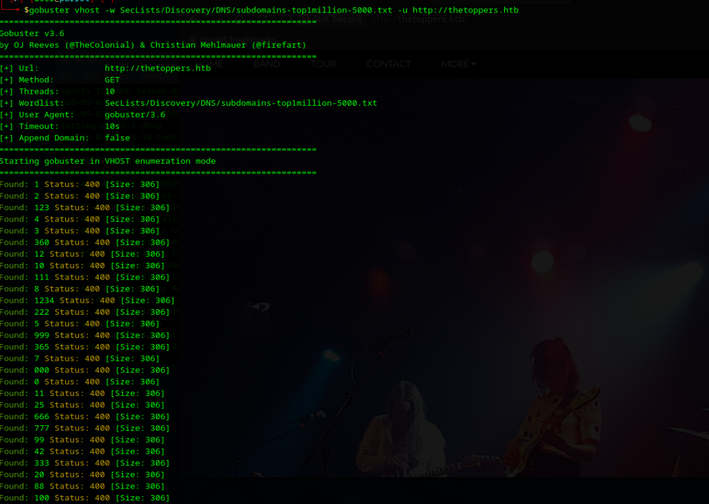
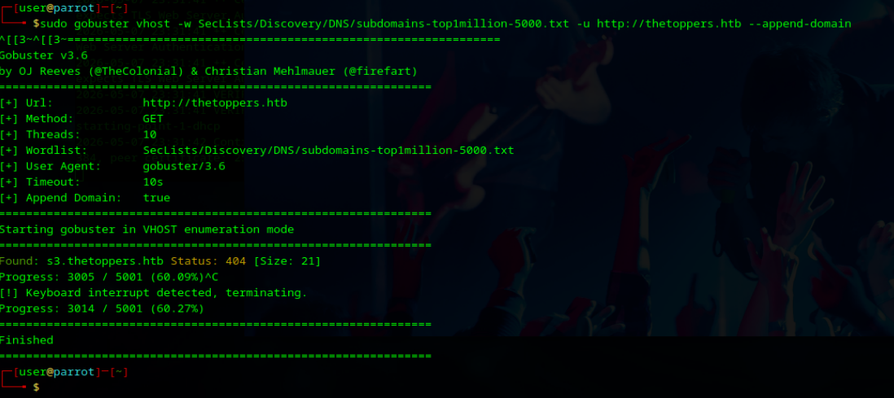
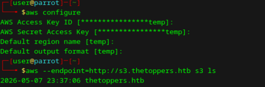
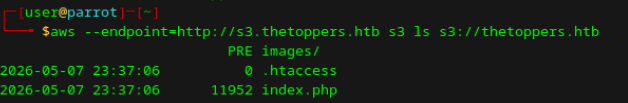
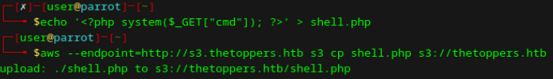
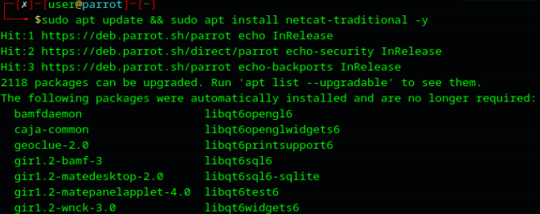
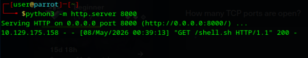
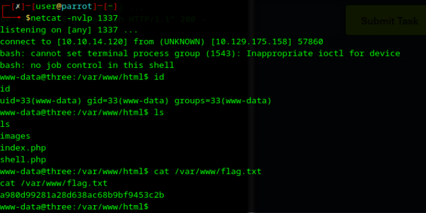

# 🎯 Laboratorio: THREE 

**📅 Fecha:** 7 de mayo de 2026 
**🖥️ IP objetivo:** 10.129.175.158

---

## 🛠️ Pasos realizados
1. **📡 Reconocimiento Inicial:** Se ejecutó un escaneo de puertos con Nmap (`sudo nmap -sV 10.129.175.158`). Se identificaron los puertos 22/tcp (SSH) y 80/tcp (Apache HTTP). Se añadió el dominio principal `thetoppers.htb` al archivo `/etc/hosts` local para permitir la resolución DNS.
2. **🌐 Enumeración de Virtual Hosts (Troubleshooting):** Se procedió a enumerar subdominios utilizando Gobuster en modo vhost.
   * *Error operativo 1:* Problemas de sintaxis iniciales (omisión del flag `-u` y rutas incorrectas al diccionario SecLists).
   * *Error operativo 2:* Al ejecutar la herramienta sin la configuración adecuada para la versión 3.6, el servidor devolvió falsos positivos masivos (código 400, tamaño 306) porque las peticiones no incluían el dominio base.
   * *Resolución:* Se añadió el parámetro `--append-domain`. La herramienta identificó correctamente el subdominio `s3.thetoppers.htb`.
3. **🪣 Interacción con la API de S3 (Troubleshooting):** Se intentó acceder al subdominio s3 vía navegador web, lo cual resultó en confusión al no devolver una interfaz gráfica.
   * *Resolución:* Se determinó que el subdominio alojaba un servicio de almacenamiento compatible con Amazon S3 (API, no web interactiva). Se configuraron credenciales locales genéricas con `aws configure` y se listó el contenido del bucket apuntando al endpoint específico (`aws --endpoint=http://s3.thetoppers.htb s3 ls s3://thetoppers.htb`). Se encontraron los archivos raíz de la web (`index.php`, `.htaccess`).
4. **💉 Explotación (Carga de Web Shell):** Al confirmar que el bucket S3 alimentaba directamente el servidor Apache en el puerto 80, se creó un archivo PHP local (`shell.php`) con la función `system($_GET["cmd"])` para lograr ejecución de código. El archivo se subió al bucket usando la herramienta de línea de comandos de AWS (`aws cp`).
5. **💻 Post-Explotación (Reverse Shell y Troubleshooting):** Se verificó la ejecución de comandos (RCE) mediante la URL `http://thetoppers.htb/shell.php?cmd=id`. Para estabilizar el acceso, se preparó un payload de Reverse Shell.
   * *Error operativo 3:* Al intentar preparar el listener local, el sistema arrojó error indicando que la herramienta nc (Netcat) no estaba disponible. Se resolvió instalando el paquete correspondiente (`sudo apt update && sudo apt install netcat-traditional -y`).
   * *Error operativo 4:* Problemas de sintaxis (caracteres `< >` literales en el payload) y codificación de URL en el navegador (caracteres de espacio y tuberías `|`) impidieron la inyección inicial.
   * *Resolución:* Se levantó un servidor web local con Python (`python3 -m http.server 8000`) alojando el script `shell.sh` configurado con la IP local de la VPN (`10.10.14.120`). Se ejecutó la orden de descarga y ejecución a través de la web shell. El listener en el puerto 1337 recibió exitosamente la conexión reversa.
6. **🚩 Extracción de la Flag:** Con acceso interactivo como el usuario `www-data`, se localizó y leyó la flag en el directorio `/var/www/flag.txt`.

## 📸 Evidencias

*(Reconocimiento)*

*(Enumeración de VHOSTS)*

*(Interacción con S3)*

*(Explotación)*

*(Troubleshooting y Post-Explotación)*

---

## ⚠️ Vulnerabilidad identificada
Mala configuración de permisos de escritura pública en un bucket de almacenamiento (S3) que actúa como directorio raíz (Webroot) de un servidor web con soporte de ejecución de scripts (PHP).

## 🚨 Riesgo asociado
**Crítico.** Permite a cualquier atacante no autenticado subir código ejecutable al servidor, derivando en Ejecución Remota de Comandos (RCE) y compromiso total de la infraestructura subyacente.

## 🛡️ Controles de seguridad recomendados
* **Restricción de permisos (IAM/Bucket Policies):** Modificar la política del bucket S3 para denegar acciones de escritura (`s3:PutObject`) a usuarios públicos o anónimos. El bucket debe ser de solo lectura para las entidades externas.
* **Separación de entornos:** Evitar el uso directo de un bucket S3 como webroot con permisos de ejecución de servidor. Si se requiere servir contenido estático desde S3, deshabilitar la ejecución de lenguajes de backend (como PHP) para los recursos alojados allí.

## 🧠 Aprendizaje personal
El laboratorio requirió adaptar metodologías estándar ante errores de herramientas. Se evidenció la diferencia operativa entre interactuar con un servicio web tradicional (puerto 80) y una API (S3). Se comprendió que herramientas como Gobuster varían su comportamiento según la versión (necesidad del flag `--append-domain` en VHOST). Además, se reforzó la importancia de la correcta codificación de caracteres en las URL para no romper la cadena de ejecución durante la inyección de una Reverse Shell y la gestión de dependencias ausentes en el sistema atacante (netcat).