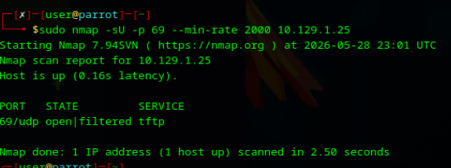
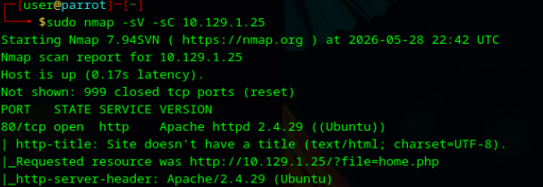
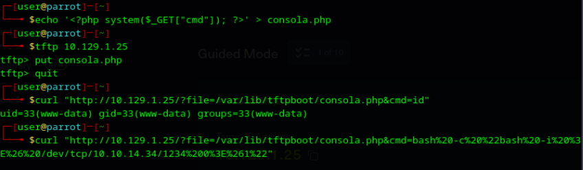
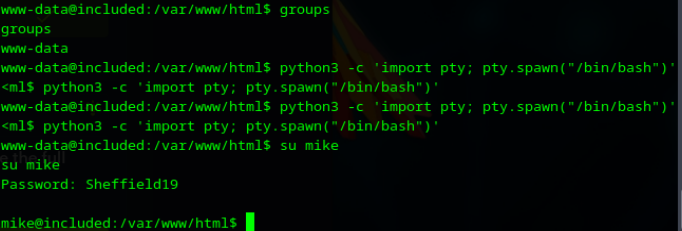
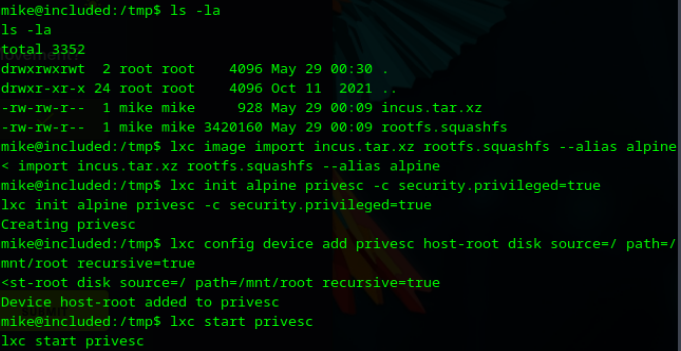
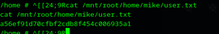
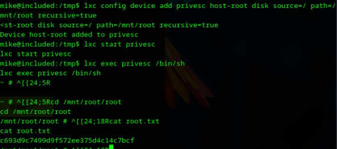

# 🎯 Laboratorio: INCLUDED

**📅 Fecha:** 9 de junio de 2026 
**🖥️ IP objetivo:** 10.129.1.25

---

## 🛠️ Pasos realizados
1. **📡 Reconocimiento de Red:** Ejecuté escaneos en ambos protocolos. El escaneo TCP (`-sC -sV`) reveló un servidor Apache en el puerto 80, mientras que un escaneo UDP optimizado (`-sU -p 69 --min-rate 2000`) descubrió el puerto 69 abierto ejecutando el servicio TFTP.
2. **🔍 Identificación de Vulnerabilidad Web:** Durante la enumeración del puerto 80, detecté que la URL utilizaba un parámetro de inclusión de archivos (`/?file=home.php`), confirmando una vulnerabilidad de Local File Inclusion (LFI).
3. **📂 Abuso de TFTP (Subida de Archivos):** Dado que TFTP es un protocolo no autenticado, creé una webshell básica en PHP de forma local (`consola.php`) y la subí exitosamente al directorio por defecto del servidor (`/var/lib/tftpboot/`) utilizando el cliente TFTP.
4. **💉 Explotación (LFI a RCE):** A través del navegador (usando `curl`), encadené el LFI para apuntar al archivo recién subido (`/?file=/var/lib/tftpboot/consola.php`). Esto me otorgó Ejecución Remota de Comandos (RCE).
5. **💻 Acceso Inicial y Movimiento Lateral:** Inyecté un payload de Reverse Shell en bash codificado en la URL. Tras recibir la conexión como el usuario `www-data`, estabilicé la terminal con Python. Posteriormente, escalé al usuario secundario `mike` ingresando su contraseña (`Sheffield19`).
6. **🚀 Escalada de Privilegios (LXD/LXC):** Al verificar los grupos del usuario `mike`, identifiqué que pertenecía al grupo `lxd`. Descargué imágenes locales de Alpine Linux (`incus.tar.xz` y `rootfs.squashfs`) y las importé al servidor.
7. **🚩 Compromiso Total y Extracción:** Inicialicé un contenedor malicioso con privilegios máximos (`security.privileged=true`) y monté la raíz del disco del host (`/`) en el directorio `/mnt/root` del contenedor. Al iniciar el contenedor y ejecutar una shell, obtuve acceso total al sistema de archivos subyacente, leyendo tanto la flag de usuario como la de root.

## 📸 Evidencias

*(Fase de Reconocimiento)*

*(Explotación)*

*(Escalada de Privilegios)*

---

## ⚠️ Vulnerabilidades identificadas
* **Inclusión de Archivos Locales (LFI):** La aplicación web procesa parámetros de entrada de archivos locales sin sanitización.
* **Configuración Insegura de TFTP:** Puerto expuesto públicamente permitiendo la escritura anónima.
* **Peligro de Escalada por Permisos de Grupo:** Asignación de usuarios no administrativos al grupo `lxd/lxc`, lo cual es equivalente a otorgar acceso `root` directo en sistemas Linux.

## 🚨 Riesgo asociado
**Crítico.** El encadenamiento de estas vulnerabilidades permite a un atacante no autenticado obtener ejecución de código inicial (RCE) y posteriormente evadir todos los controles del sistema operativo mediante la manipulación de contenedores, resultando en el compromiso total (Confidencialidad, Integridad y Disponibilidad) del servidor físico.

## 🛡️ Controles de seguridad recomendados
* **Securización del Código Web (LFI):** Implementar listas de control de acceso (Allow-lists) en el código PHP para asegurar que el parámetro `file` solo pueda incluir un conjunto estrictamente definido de archivos seguros, evitando el Directory Traversal (`../`).
* **Hardening Perimetral:** El puerto 69 (UDP) no debe estar expuesto a Internet. Bloquear el acceso externo mediante firewall perimetral y deshabilitar los permisos de escritura/subida (`PUT`) en el servidor TFTP.
* **Auditoría de Privilegios (IAM):** Remover inmediatamente al usuario `mike` (y cualquier otra cuenta no administrativa) del grupo `lxd`. La gestión de contenedores debe estar estrictamente limitada a administradores autorizados.

## 🧠 Aprendizaje personal
Este laboratorio es un claro ejemplo práctico de *Vulnerability Chaining*. Aprendí que servicios aparentemente inofensivos y aislados (como un TFTP sin autenticación) se convierten en vectores críticos cuando se combinan con vulnerabilidades de capa de aplicación (LFI). A nivel de arquitectura y SOC, reforcé la lección de que pertenecer a grupos de gestión de contenedores (Docker/LXD) es operacionalmente equivalente a ser `root`, lo que exige un monitoreo y perfilado de permisos sumamente restrictivo.