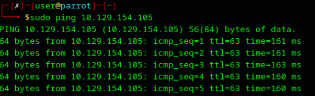
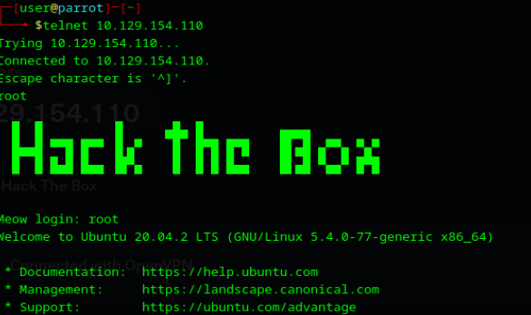

# 🎯 Hack The Box Writeup: Meow

**Fecha de ejecución:** 29 de abril de 2026
**IP Objetivo:** 10.129.154.105
**Plataforma:** Hack The Box

---

## 1. Fase de Reconocimiento

El primer paso consistió en verificar la conectividad con la máquina objetivo mediante el envío de paquetes ICMP.

```bash
ping -c 4 10.129.154.105
```



Una vez confirmada la conectividad, procedí con el escaneo de puertos y detección de versiones de servicios utilizando Nmap para mapear la superficie de ataque.

```bash
sudo nmap -sV 10.129.154.105
```


**Resultados del escaneo:** Se identificó que el puerto `23/tcp` se encontraba abierto, ejecutando el servicio **Telnet** (`Linux telnetd`).
## 2. Explotación y Compromiso

Dado que Telnet es un protocolo heredado y conocido por sus debilidades de seguridad, intenté interactuar directamente con el servicio.

```bash
telnet 10.129.154.105
```



Al solicitar credenciales, probé el acceso con el usuario por defecto de máximo privilegio (`root`) sin ingresar ninguna contraseña. El sistema permitió el inicio de sesión exitoso.

Una vez dentro del sistema, procedí a listar el directorio actual y visualizar el contenido del archivo `flag.txt`, confirmando el compromiso total de la máquina.

```bash
ls
cat flag.txt
```


## 3. Reporte de Vulnerabilidad y Riesgo

- **Vulnerabilidad Principal:** El sistema permite el acceso remoto mediante Telnet utilizando la cuenta de administrador (`root`) con una credencial en blanco (ausencia de contraseña).
    
- **Riesgo Asociado (Crítico):** Cualquier actor malicioso con acceso a la red puede tomar control total del servidor de manera trivial, sin necesidad de ejecutar exploits complejos. Esto compromete absolutamente la confidencialidad, integridad y disponibilidad (Tríada CIA) del equipo y de los datos alojados.
    
## 4. Perspectiva Defensiva y Mitigación (Blue Team)

Para remediar esta brecha de seguridad y alinear el servidor con las mejores prácticas, se recomiendan los siguientes controles:

1. **Gestión de Credenciales:** Asignar inmediatamente una contraseña robusta al usuario `root` y auditar el resto de las cuentas locales.
    
2. **Deshabilitar Protocolos Inseguros:** Apagar y desinstalar el servicio Telnet, ya que transmite toda la información (incluyendo credenciales) en texto plano, siendo susceptible a ataques de _Man-in-the-Middle_ (Sniffing).
    
3. **Implementar Administración Segura:** Reemplazar Telnet por SSH (Secure Shell) en el puerto 22, configurando preferentemente la autenticación mediante claves públicas (PKI) y deshabilitando el inicio de sesión directo con el usuario root (`PermitRootLogin no` en la configuración de SSH).
    
## 5. Conclusión y Aprendizaje

Este laboratorio demuestra que no siempre es necesario el uso de exploits sofisticados o la presencia de vulnerabilidades de software complejas para vulnerar un sistema. Una mala configuración de fábrica (misconfiguration) o la falta de políticas de contraseñas en cuentas críticas es suficiente para comprometer por completo la infraestructura operativa.
