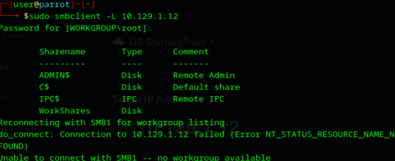

# Laboratorio: DANCING

**Fecha:** 29 de abril de 2026
**IP objetivo:** 10.129.1.12

---

## Pasos realizados
1. Identifiqué la conectividad básica con la herramienta ping.
2. Ejecuté un escaneo de servicios con Nmap (-sV), localizando el puerto 445 (SMB) activo en un sistema operativo Windows.
3. Utilicé `smbclient` con el flag `-L` para listar los recursos compartidos del servidor sin proporcionar credenciales.
4. Detecté que el share `WorkShares` permitía el acceso anónimo.
5. Me conecté al recurso compartido y navegué por los directorios de los usuarios hasta encontrar la carpeta de `James.P`.
6. Descargué el archivo `flag.txt` a mi entorno local mediante el comando `get`.

## Evidencias

---

## Vulnerabilidad identificada
Exposición de recursos compartidos (SMB Shares) con permisos de lectura para usuarios no autenticados (Guest/Anonymous access).

## Riesgo asociado
Acceso no autorizado a documentos privados y datos de usuarios de la organización. Un atacante podría obtener información para realizar movimientos laterales en la red o comprometer la privacidad de los empleados al acceder a sus carpetas personales.

## Controles recomendados
* Restringir el acceso a los recursos compartidos únicamente a usuarios autenticados mediante contraseñas robustas.
* Deshabilitar el inicio de sesión de invitados (Guest) y accesos anónimos en la política de red de Windows.
* Auditoría de permisos en carpetas compartidas para asegurar que solo el personal autorizado tenga acceso a su información respectiva.

## Aprendizaje
SMB es un protocolo crítico en entornos Windows. Aprendí que una mala configuración en los permisos de los "shares" puede exponer toda la estructura de archivos de una empresa sin necesidad de explotar un fallo del sistema operativo.