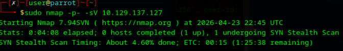
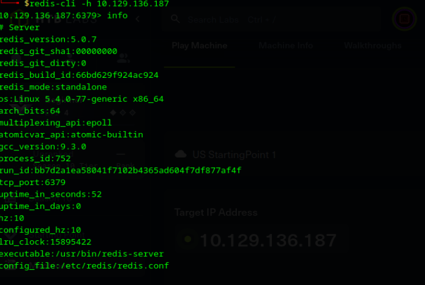
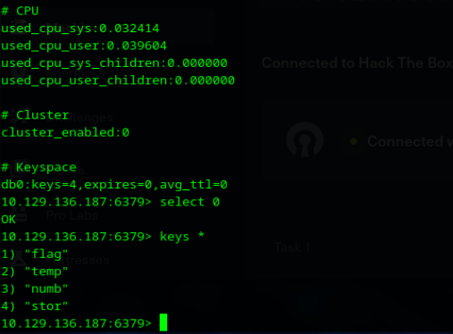

# Laboratorio: REDEEMER

**Fecha:** 29 de abril de 2026
**IP objetivo:** 10.129.137.127 y 10.129.136.187 (debido a que la retomé en diferentes días)

---

## Pasos realizados
1. Verifiqué la conectividad inicial con el objetivo mediante ping.
2. Incidente técnico: Al intentar un escaneo inicial de Nmap, los tiempos de respuesta eran excesivamente altos (estimación de más de una hora), posiblemente por congestión de red o configuración del target.
3. Solución: Optimicé el escaneo forzando una tasa mínima de paquetes con el comando `nmap -p- --min-rate 4000 [IP]`, logrando identificar el puerto 6379 en pocos segundos.
4. Identifiqué el servicio Redis versión 5.0.7 corriendo en el puerto detectado.
5. Me conecté a la base de datos utilizando la utilidad `redis-cli -h 10.129.136.187`.
6. Utilicé el comando `info` para obtener estadísticas del servidor y confirmar la existencia de llaves en el índice `db0`.
7. Seleccioné la base de datos con `select 0`, listé las llaves con `keys *` y obtuve el valor de la flag mediante `get flag`.

## Evidencias

---

## Vulnerabilidad identificada
Instancia de base de datos Redis expuesta sin autenticación (`requirepass` no configurado), permitiendo el acceso total a la información almacenada en memoria.

## Riesgo asociado
Fuga de información crítica. Redis suele usarse para caché de sesiones o tokens; el acceso no autorizado permite a un atacante secuestrar sesiones, leer datos transaccionales o incluso realizar ataques de denegación de servicio (DoS) borrando las llaves.

## Controles recomendados
* Configurar autenticación obligatoria mediante la directiva `requirepass` en el archivo de configuración.
* Restringir el acceso al puerto 6379 mediante firewall o configurando la directiva `bind` para que solo acepte conexiones locales o desde IPs autorizadas.
* Implementar túneles SSH o TLS si la conexión remota es estrictamente necesaria.

## Aprendizaje
Reforcé el uso de parámetros de rendimiento en Nmap (`--min-rate`) para entornos con alta latencia. Además, comprendí que las bases de datos "in-memory" como Redis son vectores críticos de información que suelen descuidarse a nivel de seguridad por priorizar la velocidad.