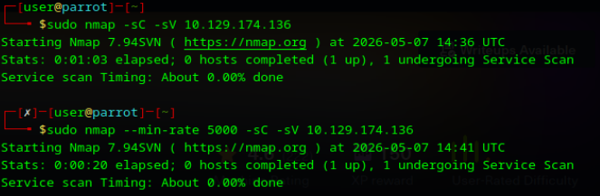
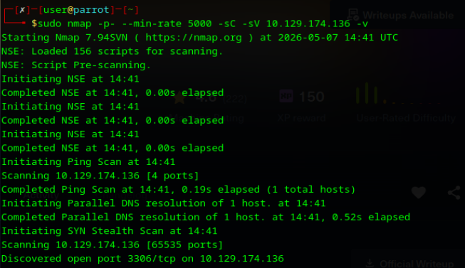
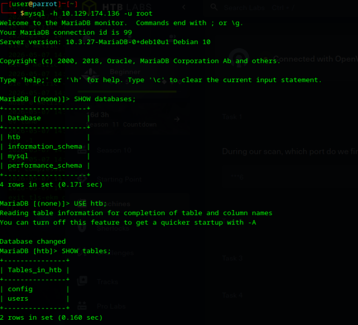

# 🎯 Laboratorio: SEQUEL

**📅 Fecha:** 7 de mayo de 2026
**👨‍🎓 Alumno:** Bautista Oliveros
**🖥️ IP objetivo:** 10.129.174.136

---

## 🛠️ Pasos realizados
1. **📡 Reconocimiento y resolución de incidentes:** Inicié un escaneo de servicios con Nmap (`-sC -sV`), pero el proceso se detuvo en la etapa de Service Scan. Identifiqué que la interacción agresiva del flag `-sV` con el servicio de base de datos generaba una latencia crítica.
2. **⚙️ Adaptación metodológica:** Para evadir el bloqueo, ejecuté un escaneo de puertos acelerado (`-p- --min-rate 5000 -v`). Esto permitió descubrir de forma inmediata el puerto 3306/tcp (MySQL/MariaDB) abierto, evitando los timeouts del escaneo de versiones.
3. **🔑 Análisis de acceso:** Al confirmar la presencia de MariaDB, utilicé el cliente de terminal para intentar una conexión administrativa: `mysql -h 10.129.174.136 -u root`.
4. **🔓 Explotación:** El sistema permitió el ingreso con privilegios de root sin solicitar credenciales, confirmando una configuración de autenticación nula.
5. **🚩 Extracción de datos:** Dentro del monitor de MariaDB, enumeré las bases de datos (`SHOW databases;`) y seleccioné la base `htb`. Finalmente, ejecuté la consulta `SELECT * FROM config;`, lo que reveló el hash de la flag.

## 📸 Evidencias

---

## ⚠️ Vulnerabilidad identificada
Falta de mecanismos de autenticación en el perfil de superusuario (`root`) para conexiones remotas en MariaDB.

## 🚨 Riesgo asociado
Acceso administrativo no autorizado. Un atacante puede exfiltrar la base de datos completa, manipular registros sensibles o utilizar el servicio como vector para movimientos laterales dentro del servidor.

## 🛡️ Controles de seguridad recomendados
* 🤖 Dado que este laboratorio representó mi primer contacto operativo con MariaDB, utilicé un asistente de IA para localizar los apartados específicos en la documentación técnica oficial (MariaDB Knowledge Base) y validar los procedimientos de remediación correctos.
* **Restricción de exposición (Hardening de Red):** Según el manual de configuración de MariaDB, se debe limitar la escucha del servicio a la interfaz local si no se requiere acceso externo. **Acción:** Editar el archivo `/etc/mysql/mariadb.conf.d/50-server.cnf` y establecer `bind-address = 127.0.0.1`.
* **Aseguramiento de credenciales administrativas:** La documentación recomienda el uso del script `mysql_secure_installation` para sanear la instalación inicial. **Acción manual:** Ejecutar `ALTER USER 'root'@'%' IDENTIFIED BY 'Nueva_Contraseña_Robusta';` para revocar el acceso anónimo y requerir autenticación fuerte.

## 🧠 Aprendizaje personal
Este laboratorio reforzó la importancia de la flexibilidad técnica ante fallos de las herramientas (como el bloqueo de Nmap). Además, aprendí a utilizar herramientas de IA para navegar rápidamente por manuales técnicos complejos, permitiéndome pasar de la explotación a la propuesta de remediación basada en fuentes oficiales en cuestión de minutos, una habilidad que considero fundamental para el trabajo diario en un SOC.