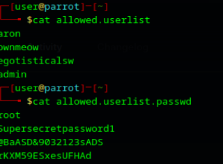
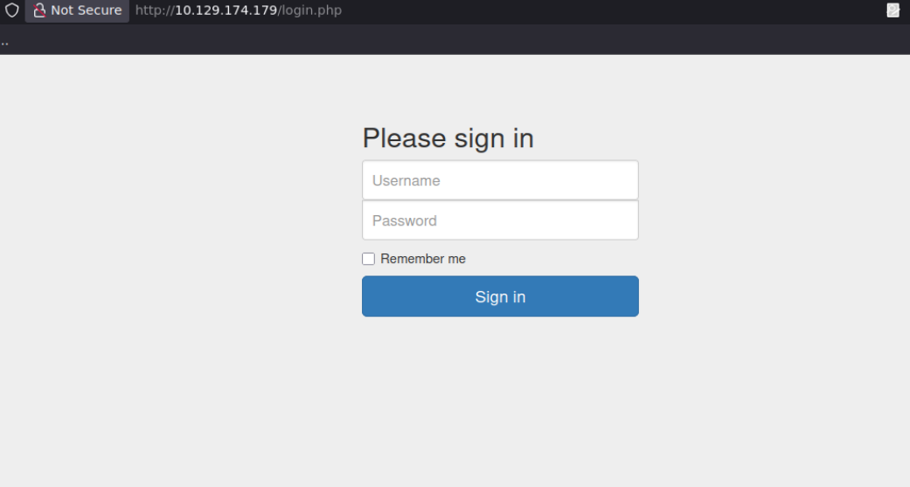

# 🎯 Laboratorio: CROCODILE

**📅 Fecha:** 7 de mayo de 2026
**🖥️ IP objetivo:** 10.129.174.179

---

## 🛠️ Pasos realizados
1. **📡 Reconocimiento Inicial:** Ejecuté un escaneo de puertos y servicios con Nmap (`sudo nmap -sC -sV 10.129.174.179`). El análisis reveló dos servicios críticos expuestos:
   * **Puerto 21/tcp (FTP):** Ejecutando vsftpd 3.0.3. El script de Nmap `ftp-anon` confirmó que el servidor permitía conexiones anónimas y listó dos archivos sospechosos en el directorio raíz.
   * **Puerto 80/tcp (HTTP):** Ejecutando Apache httpd 2.4.41.
2. **🔓 Explotación de FTP (Fuga de Información):** Me conecté al servidor FTP utilizando las credenciales anónimas (`anonymous` sin contraseña). Navegué por el directorio y extraje los archivos detectados previamente mediante el comando `get`:
   * `allowed.userlist`: Contenía una lista de 4 nombres de usuario (incluyendo admin).
   * `allowed.userlist.passwd`: Contenía una lista de 4 contraseñas en texto plano.
3. **🌐 Enumeración Web:** Al acceder al puerto 80 a través del navegador, observé una página institucional estándar. Utilicé Wappalyzer para confirmar las tecnologías subyacentes (Apache, Ubuntu, Bootstrap) y procedí a mapear la estructura oculta del sitio.
4. **📂 Descubrimiento de Directorios:** Ejecuté Gobuster en modo directorio (`gobuster dir --url http://10.129.174.179/ --wordlist /usr/share/wordlists/dirbuster/directory-list-2.3-small.txt -x php,html`). La herramienta descubrió un portal de autenticación expuesto en la ruta `/login.php`.
5. **💉 Explotación (Access Control Bypass):** Accedí al formulario en `/login.php`. Al poseer un volumen reducido de credenciales fugadas desde el FTP, opté por un ataque de comprobación cruzada manual en lugar de automatizarlo. Prioricé el usuario de mayor privilegio (`admin`) e iteré secuencialmente las contraseñas extraídas. El acceso fue exitoso con la contraseña `rKXM59ESxesUFHAd`, otorgando control total sobre el "Server Manager Dashboard" y revelando la flag.

## 📸 Evidencias

---

## ⚠️ Vulnerabilidad identificada
Se explotó una cadena de vulnerabilidades (Vulnerability Chaining):
* **Configuración insegura de FTP (A05:2021-Security Misconfiguration):** Acceso anónimo habilitado exponiendo archivos sensibles del sistema.
* **Exposición de datos sensibles (A02:2021-Cryptographic Failures):** Almacenamiento de credenciales administrativas en archivos de texto plano dentro de un directorio de acceso público.

## 🚨 Riesgo asociado
Compromiso total del servidor de gestión. La exposición de las listas de usuarios y contraseñas (incluyendo la cuenta del administrador) permitió el acceso ilegítimo al panel de control web, derivando en una brecha total de confidencialidad e integridad del entorno.

## 🛡️ Controles de seguridad recomendados
* **Securizar el servicio FTP:** Modificar el archivo `/etc/vsftpd.conf` y establecer la directiva `anonymous_enable=NO`. Reiniciar el servicio con `systemctl restart vsftpd`.
* **Gestión Segura de Credenciales:** Eliminar de forma inmediata los archivos `allowed.userlist` y `allowed.userlist.passwd` del servidor. Las credenciales jamás deben almacenarse en texto plano, y mucho menos en directorios accesibles públicamente.
* **Auditoría de contraseñas:** Rotar inmediatamente la contraseña del usuario `admin` (y de los demás afectados), ya que ha sido comprometida.

## 🧠 Aprendizaje personal
En este laboratorio comprobé el impacto crítico del "Vulnerability Chaining". Una vulnerabilidad de configuración "menor" (un FTP anónimo) que a simple vista podría parecer de bajo riesgo, se convirtió en el vector de compromiso total al combinarse con el descubrimiento de un panel de login oculto. Aprendí que la información extraída de un servicio (puerto 21) suele ser la llave para comprometer otro (puerto 80).