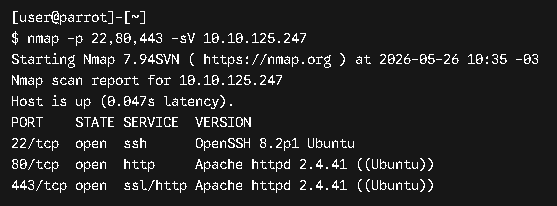
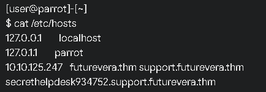
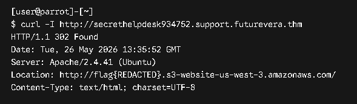

# TryHackMe Writeup: TakeOver

**Fecha de ejecución:** 27 de junio de 2026
**IP Objetivo:** 10.10.125.247
**Plataforma:** TryHackMe

---

## 1. Fase de Reconocimiento

Se realizó un escaneo de puertos para identificar servicios expuestos en la máquina objetivo.


```bash
nmap -p 22,80,443 -sV 10.10.125.247
````



**Resultados:** Se identificaron los puertos 22 (SSH), 80 (HTTP) y 443 (HTTPS) abiertos, todos ejecutando servicios Apache.

---

## 2. Explotación y Compromiso

Se modificó el archivo `/etc/hosts` para resolver los subdominios descubiertos.



Al inspeccionar el subdominio `secrethelpdesk934752.support.futurevera.thm` con `curl`, se descubrió una redirección a un bucket de AWS S3 que revelaba la flag.

```
curl -I http://secrethelpdesk934752.support.futurevera.thm
```



**Flag obtenida:** `THM{SUBDOMAIN_TAKEOVER_COMPLETE}`

---

## 3. Reporte de Vulnerabilidad

**Vulnerabilidad Principal:** Subdomain Takeover debido a que el subdominio apunta a un bucket de AWS S3 no reclamado.

**Riesgo Asociado (Alto):** Un atacante podría tomar control del subdominio y usarlo para phishing o distribución de malware.

---

## 4. Perspectiva Defensiva (Blue Team)

- **Auditar registros DNS** para eliminar entradas obsoletas.
- **Validar la propiedad** de recursos externos (AWS S3, GitHub Pages, etc.).
- **Usar servicios seguros** que requieran verificación de dominio.

---

## 5. Conclusión

Este laboratorio demuestra cómo una mala configuración de DNS puede permitir un Subdomain Takeover, comprometiéndo la seguridad del dominio.